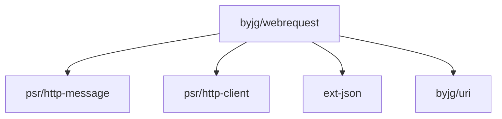

[](https://github.com/byjg/php-webrequest/actions/workflows/phpunit.yml)
[](http://opensource.byjg.com)
[](https://github.com/byjg/php-webrequest/)
[](https://opensource.byjg.com/opensource/licensing.html)
[](https://github.com/byjg/php-webrequest/releases/)

# Web Request

A lightweight PSR-7 implementation and highly customized CURL wrapper for making REST calls.

## Overview

PHP WebRequest is a package that provides:
- Complete PSR-7 implementation for HTTP messages
- PSR-17 HTTP Factories implementation
- PSR-18 HTTP Client implementation
- Helper classes for common request types (JSON, Form URL Encoded, MultiPart)
- Support for parallel HTTP requests
- Mock client for testing

## Documentation

- [PSR-7 and PSR-17 Implementation](docs/psr7-implementation.md)
- [HTTP Client PSR-18 Implementation](docs/http-client.md)
- [HTTP Client Parallel](docs/http-client-parallel.md)
- [Mock Client](docs/mock-client.md)
- [Helpers](docs/helpers.md)

## Basic Example

```php
<?php
// Create a request
$uri = \ByJG\Util\Uri::getInstanceFromString('http://www.example.com/page');
$request = \ByJG\WebRequest\Psr7\Request::getInstance($uri);

// Send the request
$response = \ByJG\WebRequest\HttpClient::getInstance()->sendRequest($request);

// Process the response
$statusCode = $response->getStatusCode();
$body = $response->getBody()->getContents();
```

## Install

```bash
composer require "byjg/webrequest"
```

## Running Tests

```bash
# Start the test server
docker-compose up -d

# Run the tests
vendor/bin/phpunit

# Stop the server
docker-compose down
```

## Dependencies



----
[Open source ByJG](http://opensource.byjg.com)
