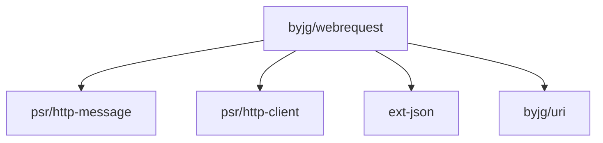

[](https://github.com/byjg/php-webrequest/actions/workflows/phpunit.yml)
[](http://opensource.byjg.com)
[](https://github.com/byjg/php-webrequest/)
[](https://opensource.byjg.com/opensource/licensing.html)
[](https://github.com/byjg/php-webrequest/releases/)

# Web Request

A lightweight PSR-7 implementation and highly customized CURL wrapper for making REST calls.

## Overview

PHP WebRequest is a **fully PSR-compliant** HTTP client package that provides:

### PSR Implementations
- ✅ **[PSR-7](https://www.php-fig.org/psr/psr-7/)** - HTTP Message Interface (Request, Response, Stream)
- ✅ **[PSR-17](https://www.php-fig.org/psr/psr-17/)** - HTTP Factories (Request, Response, Stream, etc.)
- ✅ **[PSR-18](https://www.php-fig.org/psr/psr-18/)** - HTTP Client Interface

### Additional Features
- Helper classes for common request types (JSON, Form URL Encoded, MultiPart)
- Support for parallel HTTP requests
- Mock client for testing

## Documentation

- [HTTP Messages and Factories (PSR-7/PSR-17)](docs/psr7-implementation.md) - Create and manipulate HTTP requests, responses, and streams
- [Sending HTTP Requests (PSR-18)](docs/http-client.md) - Send HTTP requests with customizable options (proxy, SSL, timeouts)
- [Parallel Requests](docs/http-client-parallel.md) - Execute multiple HTTP requests concurrently for better performance
- [Testing with Mock Client](docs/mock-client.md) - Test HTTP code without real network calls
- [Request Helpers](docs/helpers.md) - Quickly build JSON, Form, and MultiPart requests
- [Comparison with Guzzle](docs/comparison-with-guzzle.md) - How WebRequest compares to Guzzle HTTP client

## Basic Example

```php
<?php
// Create a request
$uri = \ByJG\Util\Uri::getInstanceFromString('http://www.example.com/page');
$request = \ByJG\WebRequest\Psr7\Request::getInstance($uri);

// Send the request
$response = \ByJG\WebRequest\HttpClient::getInstance()->sendRequest($request);

// Process the response
$statusCode = $response->getStatusCode();
$body = $response->getBody()->getContents();
```

## Install

```bash
composer require "byjg/webrequest"
```

## Running Tests

```bash
# Start the test server
docker-compose up -d

# Run the tests
vendor/bin/phpunit

# Stop the server
docker-compose down
```

## Dependencies



----
[Open source ByJG](http://opensource.byjg.com)
