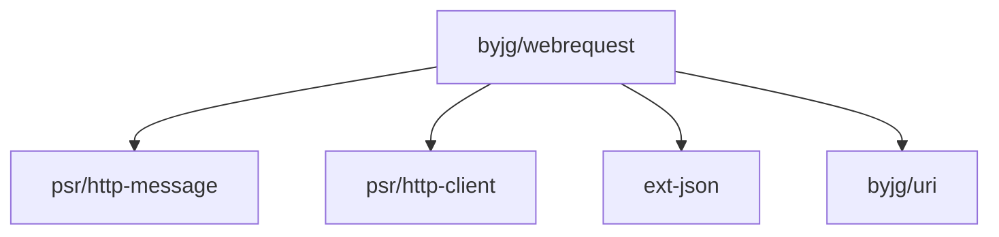

[](https://github.com/byjg/php-webrequest/actions/workflows/phpunit.yml)
[](http://opensource.byjg.com)
[](https://github.com/byjg/php-webrequest/)
[](https://opensource.byjg.com/opensource/licensing.html)
[](https://github.com/byjg/php-webrequest/releases/)

# Web Request

A lightweight PSR-7 implementation and highly customized CURL wrapper for making REST calls.

## Main Features

This class implements:
* PSR-7 Request and Response;
* PSR-17 Http Factories;
* PSR-18 Http Client;
* Helper to create Request instances with the most common use cases;
* Wrapper to execute several requests in parallel;
* Promise-based interface for asynchronous requests;

## PSR-7 Implementation and basic usage

Since the implementation follows the PSR-7 specification, there is no much explanation about the usage.

The key elements are:

* URI - Will define the URI with parameters, path, host, schema, etc
* Request - Will set the request headers and method;
* Response - Will receive the response header, body and status code.

More information about the PSR-7 [here](https://www.php-fig.org/psr/psr-7/).

The implementation to send the request object is defined by the class `HttpClient`.
This class follows the PSR-18 implementation.
So, once you have a Request instance defined just need to call `HttpClient::sendRequest($request);`

### Basic Usage

```php
<?php
$uri = \ByJG\Util\Uri::getInstanceFromString('http://www.example.com/page');
$request = \ByJG\WebRequest\Psr7\Request::getInstance($uri);
$response = \ByJG\WebRequest\HttpClient::getInstance()->sendRequest($request);
```

### Passing arguments

```php
<?php
$uri = \ByJG\Util\Uri::getInstanceFromString('http://www.example.com/page')
    ->withQuery(http_build_query(['param'=>'value']));

$request = \ByJG\WebRequest\Psr7\Request::getInstance($uri);
$response = \ByJG\WebRequest\HttpClient::getInstance()->sendRequest($request);
```

## Helper Classes

The WebRequest package has Helper classes to make it easy to create Request instances for some use cases.

### Passing a string payload (JSON)

```php
<?php
$uri = \ByJG\Util\Uri::getInstanceFromString('http://www.example.com/page');
$request = \ByJG\WebRequest\Helper\RequestJson::build(
   $uri,
   "POST",
   '{teste: "value"}'  // Support an associate array
);
$response = \ByJG\WebRequest\HttpClient::getInstance()->sendRequest($request);
```

### Create a Form Url Encoded (emulate HTTP form)

```php
<?php
$uri = \ByJG\Util\Uri::getInstanceFromString('http://www.example.com/page');
$request = \ByJG\WebRequest\Helper\RequestFormUrlEncoded::build(
   $uri,
   ["param" => "value"]
);
$response = \ByJG\WebRequest\HttpClient::getInstance()->sendRequest($request);
```

### Create a Multi Part request (upload documents)

```php
<?php
$uri = \ByJG\Util\Uri::getInstanceFromString('http://www.example.com/page');

// Define the contents to upload using a list of MultiPartItem objects
$uploadFile = [];
$uploadFile[] = new \ByJG\WebRequest\MultiPartItem('field1', 'value1');
$uploadFile[] = new \ByJG\WebRequest\MultiPartItem(
    'field2',
    '{"key": "value2"}',
    'filename.json',
    'application/json; charset=UTF-8'
);
$uploadFile[] = new \ByJG\WebRequest\MultiPartItem('field3', 'value3');

// Use the Wrapper to create the Request
$request = \ByJG\WebRequest\Helper\RequestMultiPart::build(\ByJG\Util\Uri::getInstanceFromString($uri),
    "POST",
    $uploadFile
);

// Do the request as usual
$response = \ByJG\WebRequest\HttpClient::getInstance()->sendRequest($request);
```

## Customizing the Http Client

The customizations options are:

```php
<?php

$client = \ByJG\WebRequest\HttpClient::getInstance()
    ->withNoFollowRedirect()         // HttpClient will not follow redirects (status codes 301 and 302). Default is follow
    ->withNoSSLVerification()        // HttpClient will not validate the SSL certificate. Default is validate.
    ->withProxy($uri)                // Define a http Proxy based on the URI.
    ->withCurlOption($key, $value)   // Set an arbitrary CURL option (use with caution)
;

```

## HttpClientParallel

You can use the HttpClient to do several different requests in parallel.

To use this functionality you need:

1. Create an instance of the HttpClientParallel class
2. Add the RequestInterface instance
3. Execute

The results will be processed as soon as they are ready.

Below is a basic example:

```php
<?php
// Create the instances of the requirements
$httpClient = \ByJG\WebRequest\HttpClient::getInstance();

$onSuccess = function ($response, $id) {
    // Do something with Response object
};

$onError = function ($error, $id) use (&$fail) {
    // Do something
};

// Create the HttpClientParallel
$multi = new \ByJG\WebRequest\HttpClientParallel(
    $httpClient,
    $onSuccess,
    $onError
);

// Add the request to run in parallel
$request1 = Request::getInstance($uri1);
$request2 = Request::getInstance($uri2);
$request3 = Request::getInstance($uri3);

$multi
    ->addRequest($request1)
    ->addRequest($request2)
    ->addRequest($request3);

// Start execute and wait to finish
// The results will be get from the closure defined above.
$multi->execute();
```

## Mocking Http Client

The class `MockClient` has the same methods that HttpClient except by:

* Do not send any request to the server;
* You can add the expected Response object;
* You can collect information from the CURL after submit the request.

### Setting the expected response object

```php
<?php
$expectedResponse = new Response(200);

$mock = $this->object = new MockClient($expectedResponse);
$response = $mock->sendRequest(new Request("http://example.com"));

assertEquals($expectedResponse, $response);
```

### Debugging the CURL options

```php
<?php
$expectedResponse = new Response(200);

$mock = $this->object = new MockClient($expectedResponse);
$response = $mock->sendRequest(new Request("http://example.com"));

$expectedCurlOptions = [
    CURLOPT_CONNECTTIMEOUT => 30,
    CURLOPT_TIMEOUT => 30,
    CURLOPT_HEADER => true,
    CURLOPT_RETURNTRANSFER => true,
    CURLOPT_USERAGENT => "Mozilla/4.0 (compatible; MSIE 5.01; Windows NT 5.0)",
    CURLOPT_FOLLOWLOCATION => true,
    CURLOPT_SSL_VERIFYHOST => 2,
    CURLOPT_SSL_VERIFYPEER => 1,
    CURLOPT_HTTPHEADER => [
        'Host: localhost:8080'
    ],
];

assertEquals($expectedCurlOptions, $mock->getCurlConfiguration());
```

### Other methods in the MockClient

The methods below are available *after* the execution of the method `sendRequest()`:

* getCurlConfiguration()
* getRequestedObject()
* getExpectedResponse()

## Install

```bash
composer install "byjg/webrequest"
```

## Running Tests

### Starting the server

We provide a docker-compose to enable start the test server easily.

```bash
docker-compose up -d
```

### Running the integration tests

```bash
vendor/bin/phpunit
```

### Stopping the server

```bash
docker-compose down
```

## Dependencies



----
[Open source ByJG](http://opensource.byjg.com)
